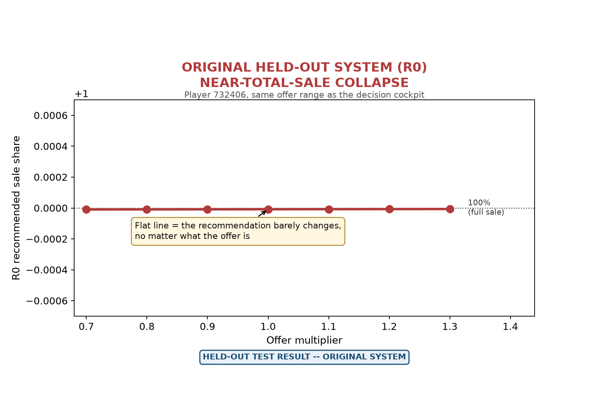
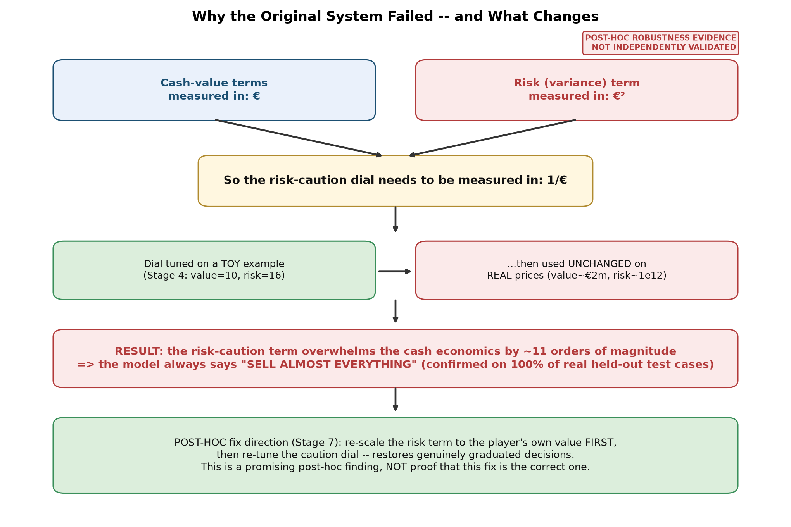
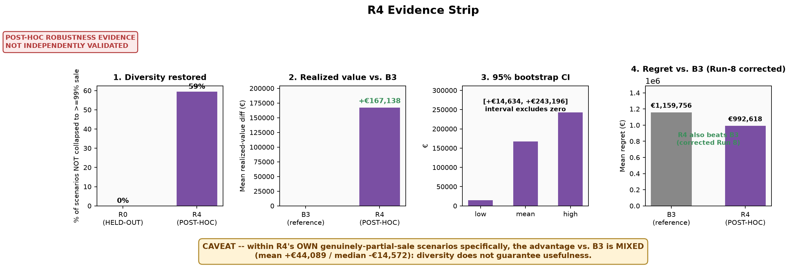

# How Much of a Player Should a Club Sell? Forecast-Based Offer x Share Decision Support in La Liga

This repository contains the final paper, scientific figures, aggregate results, and public-safe
reproduction materials for MIT Sloan Sports Analytics Conference Problem 8. The study structures
the sale-share decision around current value, forecast future value, offer size, immediate cash,
retained upside, uncertainty, risk preference, and break-even logic.

> **Scientific status.** The 12-month forecast shows modest held-out predictive skill. The original
> decision rule, R0, failed its held-out test. R4 is a promising post-hoc reformulation evaluated on
> the same already-open test set and is not independently validated. This repository does not claim
> to have solved the optimal player-sale problem.

**This research was developed in collaboration with SoccerSolver. SoccerSolver currently works with more than 10 football clubs.**

## Football decision context

A club considering an offer must decide how much economic exposure to realize immediately and how
much future upside to retain. This project treats the choice as an auditable grid of offer and sale
share scenarios. Offers are scenario inputs rather than historically observed bids, and the study
has no historical optimal-share labels.

## Study design and data foundation

The canonical analysis contains **8,433 player-decision events** for **1,132 La Liga players** from
**1 July 2022 through 30 June 2025**. Date-based separation produced zero temporal-leakage
violations in the final audit.

The primary modeled horizon is 12 months, with **54.06% usable label coverage**. Twenty-four-month
coverage is 25.36% and is treated as low-confidence rather than a primary cockpit output.
Thirty-six-month coverage is 0%, so no 36-month model is reported.

## Future-value forecasting layer

A gradient-boosted model predicts player value approximately 12 months ahead. It was fixed before
held-out evaluation.

| Forecast metric | Held-out result |
|---|---:|
| Log-MAE | 0.526 |
| Persistence log-MAE | 0.577 |
| Spearman correlation | 0.582 |

Lower log-MAE is better. The forecasting layer demonstrates modest predictive skill relative to
persistence, not production-grade precision or guaranteed future value.

## Original R0 decision model

R0 combines immediate sale proceeds, discounted expected retained value, and a variance-based risk
penalty. Its risk-aversion setting was inherited from a small numerical calibration and was not
calibrated to a real club.

| R0 held-out diagnostic | Result |
|---|---:|
| Offer / discount / risk scenarios | 148,176 |
| Scenarios recommending at least 99.9% sale | 100% |
| Held-out verdict | **Not supported** |

The original model was effectively pinned near total sale across the tested offer range. Under
realized outcomes, it did not clearly outperform B3, the transparent risk-neutral boundary
comparator. The failed original result is retained prominently rather than hidden.



*Figure 1. Held-out test result for the original R0 system. The recommendation remains near total
sale across the tested offer range.*

## Why R0 failed

The diagnosis is dimensional. Cash and future-value terms are measured in euros, while the
variance-based risk term is measured in euros squared. The original risk-aversion parameter
therefore requires inverse-euro units but was carried from a toy numerical scale to realistic
football valuations without corresponding rescaling. At real-value magnitudes, the risk term
overwhelms the cash-value terms by approximately 11 orders of magnitude.



*Figure 2. Post-hoc mechanistic diagnosis of R0's collapse. The diagnosis explains the failure but
does not establish that a particular reformulation is correct.*

## B3 comparator

B3 is a simple, transparent, risk-neutral boundary rule with no fitted risk-preference parameter.
It is used as the reference decision comparator and should not be interpreted as a sophisticated
optimization model.

## Post-hoc reformulations

Five alternatives were examined after the held-out result was known:

- **R1:** current-value-normalized variance;
- **R2:** expected-value-normalized variance;
- **R3:** linearized lognormal variance diagnostic;
- **R4:** CRRA certainty-equivalent formulation; and
- **R5:** downside-constrained CVaR formulation.

R1, R2, and R5 restore some graduated recommendations but are robustly worse than B3. R3 retains
the collapse. R4 is the most promising post-hoc formulation. None is independently validated.

## Post-hoc R4 evidence

| Metric | R4 result |
|---|---:|
| Scenarios outside the at-least-99% sale bucket | 59.4% |
| Mean realized-value difference versus B3 | +EUR167,138 |
| Player-clustered 95% bootstrap interval | [+EUR14,634, +EUR243,196] |
| Mean regret, R4 | EUR992,618 |
| Mean regret, B3 | EUR1,159,756 |

**R4 was developed and evaluated post-hoc on the already-open held-out test set. These results are
not independent validation and require confirmation on genuinely fresh data.** Within R4's own
genuinely partial-sale scenarios, the evidence is mixed; restored diversity does not by itself
prove useful recommendations.



*Figure 3. Post-hoc R4 evidence relative to B3. The result is not independently validated, and the
partial-sale-only caveat remains material.*

## Official software and application context

The final paper contains an authorized publication-facing software screenshot illustrating the
practical offer x share workflow. It is application context, not an empirical output of the research
model, and the study did not recover or reproduce proprietary software formulas. No standalone
screenshot is included here because repository redistribution permission was not documented.

## What the study establishes

- A leakage-safe 12-month player-value forecasting layer with modest held-out skill.
- An honest held-out rejection of the original R0 decision rule.
- A mechanistic dimensional explanation for R0's near-total-sale collapse.
- A transparent offer x share framework that can be evaluated again on fresh data.
- Promising but explicitly post-hoc evidence for R4 relative to B3.

## What the study does not establish

- The optimal percentage of a player to sell or a universally optimal sale share.
- Historical optimal-share learning or observed historical offer-price modeling.
- Causal effects of selling different percentages.
- Independent validation or production readiness of R4.
- Real-club calibration of risk preferences.
- Precise 24-month forecasts or any 36-month forecast.
- Recovery of proprietary formulas or equivalence to production software.

## Data availability

Raw, processed, and player-level analytical data are excluded because redistribution rights are not
established for every source. The repository provides aggregate metrics, schemas, provenance notes,
and public-safe reconstruction guidance. See [`docs/data_provenance.md`](docs/data_provenance.md).

## Reproduction

Python 3.12 was used for release testing.

```bash
python -m venv .venv
source .venv/bin/activate
python -m pip install -r requirements.txt
python scripts/verify_release.py
python src/build_release_figures.py
```

The validator checks headline values, CSV schemas, files, links, portability, restricted formats,
and safety conditions. Figure generation uses only included aggregate results. Full model refitting
requires authorized source data and is therefore outside this partial public reproduction package.

## Repository structure

```text
assets/      Researcher photograph and collaboration logo
docs/        Methodology, provenance, model status, limitations, and reproduction notes
figures/     Final research-generated scientific figures
paper/       Final public paper
results/     Aggregate public-safe metrics
scripts/     Release verification
src/         Public-safe summary-figure generation
```

## Paper

The final paper is available at
[`paper/Problem8_Player_Sale_Share_Optimization.pdf`](paper/Problem8_Player_Sale_Share_Optimization.pdf).

---

## Researcher

<p align="left"></p>

### Rupayan Halder

**PhD Student — Jadavpur University, Kolkata**  
**Football AI Researcher**  
**Assistant Professor — University of Engineering & Management (UEM), Kolkata**  
**Research Collaborator — SoccerSolver**  
**Former Software Engineer — Platform Engineering — Session AI**

Rupayan's research interests focus on applying artificial intelligence, machine learning, data
analytics, and computational methods to real-world problems in football, including player
performance analysis, recruitment, transfer-market decision-making, and sporting strategy.

### Connect

[GitHub](https://github.com/RupayanHalder39) ·
[LinkedIn](https://www.linkedin.com/in/rupayan-halder-962922209/) ·
[Email](mailto:rupayanhalder313239@gmail.com)

---

## Research Collaboration

<p align="left"></p>

Collaboration does not imply that the research recovered proprietary formulas or that every claim
represents a production-software result.

## Citation

Please cite this repository using [`CITATION.cff`](CITATION.cff).

## License

Repository code is provided under the MIT License. The license does not grant rights to the paper,
datasets, software screenshots, logos, trademarks, photographs, or other external assets.
